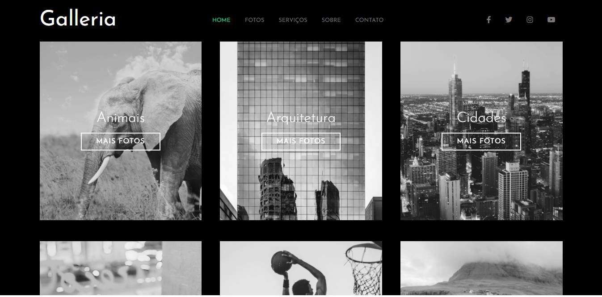

<h1 align="center">
Galleria
</h1>

## 💻 Sobre o projeto

O projeto foi desenvolvido no curso de Sass do Matheus Battisti - Hora de Codar.

## 🖼 Screenshot da tela da aplicação

 

 

## 🛠 Tecnologias

As seguintes ferramentas foram usadas na construção do projeto:

### **Front-end**

 
- [x]HTML5 
- [x] CSS3 
- [x] Sass 
 

* Link do projeto => https://marcelfeo.github.io/galleria-sass/
